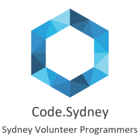

# Code.Sydney

### _A volunteer coder community based in Sydney, Australia_



## Setup

1. Install [NVM](https://github.com/nvm-sh/nvm) or [NVM-Windows](https://github.com/coreybutler/nvm-windows).
   - _NVM-Windows_ `nvm install latest`
   - _NVM_ [manual](https://github.com/nvm-sh/nv)
2. Set node version:
   - If NVM - `nvm use`
   - If NVM-Windows - `nvm use [insert version of latest - can be found with 'nvm list']`
3. Install Vue:
   - Install the [Vue CLI](https://cli.vuejs.org/guide/installation.html).
   - _Recommended_ Install Vue [Devtools](https://vuejs.org/v2/guide/installation.html#Vue-Devtools).
   
4. Install [VS Code](https://code.visualstudio.com/download).
   Setup VS Code extensions:
   - Vetur
   - ESLint
   - Prettier
5. <b>Open one terminal</b>, navigate to the client directory `cd client` in your terminal and run:

```
npm install
npm run serve
```

1. <b>Open another terminal</b>, `cd client`, and run `json-server --watch membersDb.json`
2. Open your browser and navigate to `localhost:8080/`.

## Git setup:

1. Install [git](https://git-scm.com/downloads).
2. Open your terminal and enter... - `git config --global user.name "Your name here"` - `git config --global user.email "your_email@example.com`  
   _Replace the quotation sections with your name and email address respectively, without the quotes.
   Ensure that the email address is the same as your Github account._
3. Navigate to your desired workspace in the terminal.
4. Enter `git clone https://github.com/codesydney/codesydney.git`.
5. Navigate to the root folder `cd codesydney/`.

## Git workflow:

_Reference:_ [git - the simple guide](https://rogerdudler.github.io/git-guide/)

1. Create a new branch for the issue you are working on.
2. Make changes to you code.
3. Add the changes to the Index and commit the changes.
   - _Ensure you include a descriptive, yet concise, description of the changes._
   - Repeat until your issue is finished.
4. Push to the Github repository `git push origin "my_branch_name"`.
   - _Becareful not to push to master._
5. Open Github in your browser and submit a new pull request.

## Project Staging URL hosted in Netlify:

[Project Staging URL](https://code-dot-sydney.netlify.app/)
